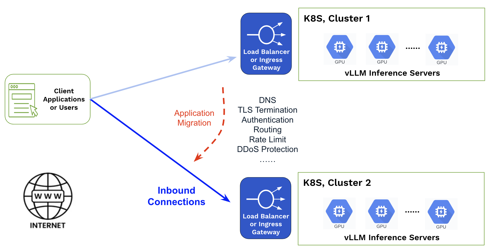
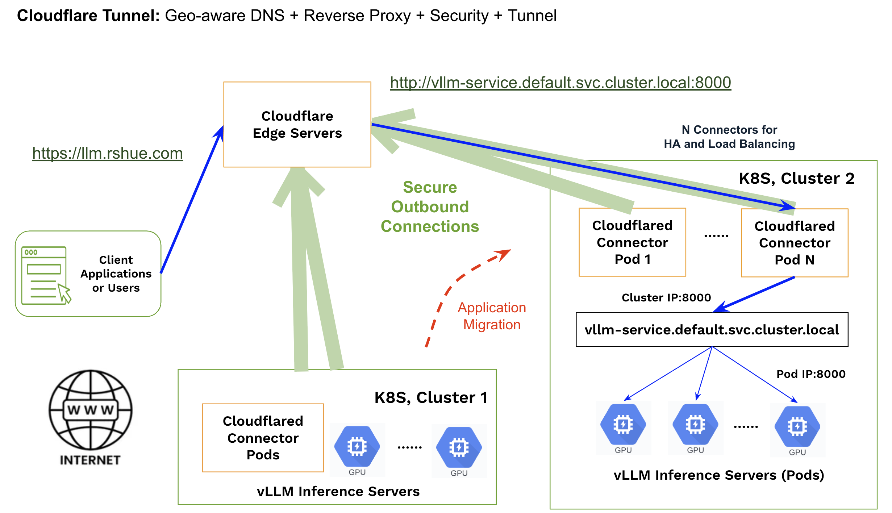
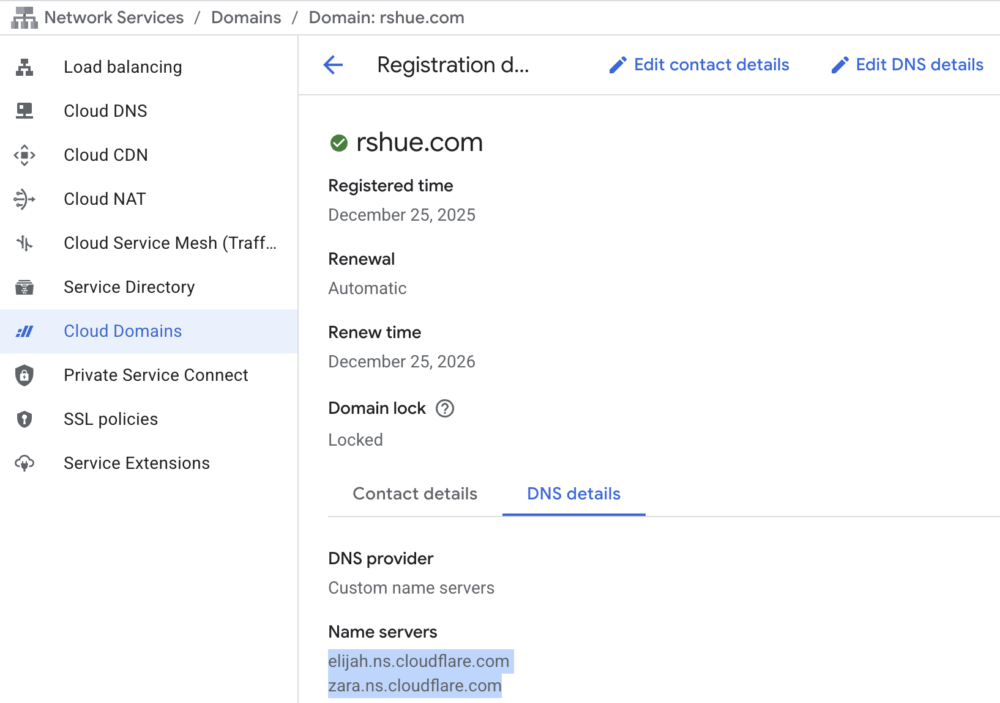
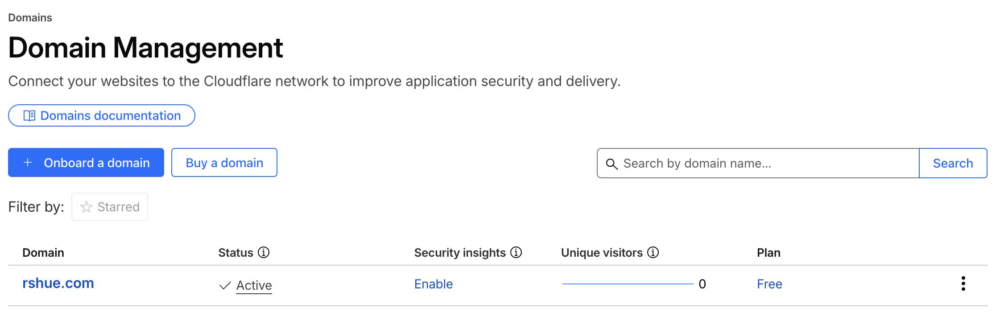
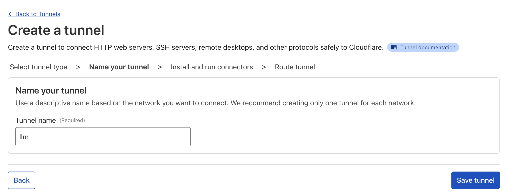
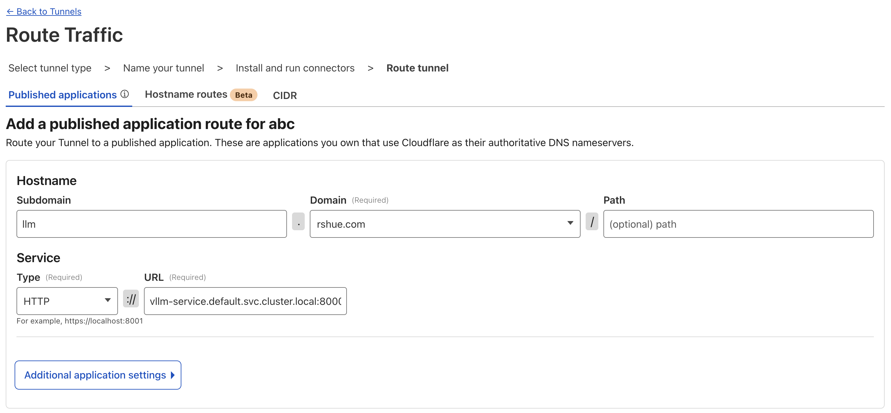
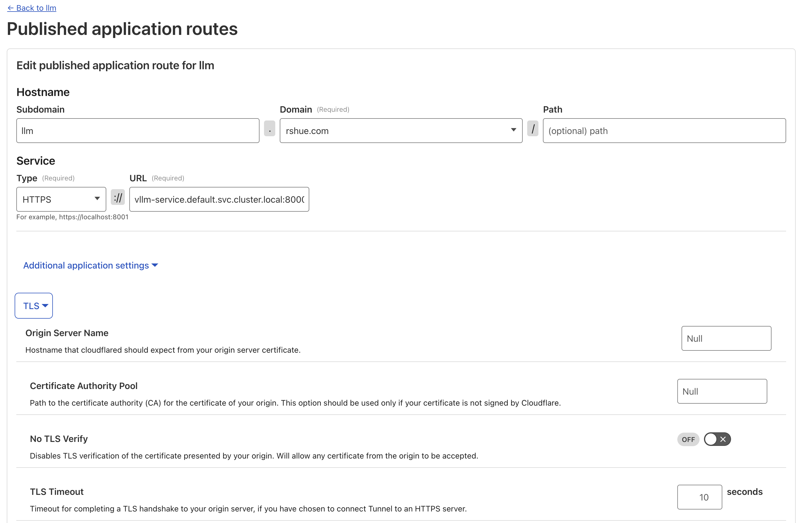
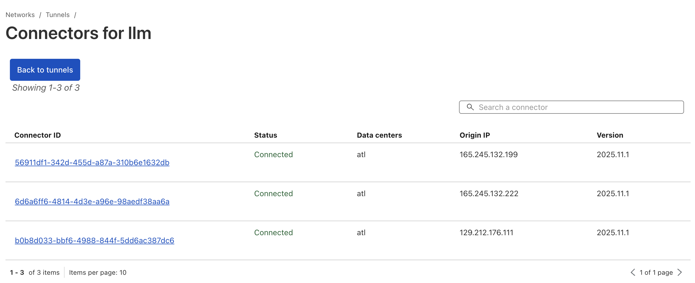
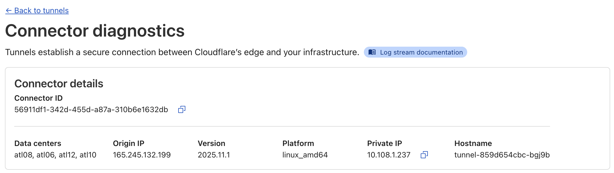

# Tunnels for AI Inference

## Introduction

Running AI inference workloads (e.g., LLMs) on Kubernetes with GPU-enabled nodes is relatively straightforward: select a pre-trained model, deploy multiple replicas of a vLLM server that support OpenAI-compatible APIs, and expose them through a Kubernetes Service such as NodePort or LoadBalancer.

As the number of exposed services increases, an ingress layer becomes essential for traffic routing and consolidation. Common choices include NGINX Ingress and modern Gateway API–based solutions such as Cilium.

At this point, DNS management and security controls—such as TLS termination and certificates, authentication, rate limiting, and DDoS protection—become critical for the secure operation of public-facing inference endpoints.

Over time, you may need to upgrade an existing Kubernetes cluster using strategies like rolling updates or blue/green deployments, or migrate workloads to a new cluster with additional GPU capacity or in a different region. In these scenarios, service endpoints often change, and the resulting endpoint switching can be visible to upstream applications or end users if not carefully managed.



## Solution Overview

A tunnel-based solution may reduce the complexity of managing application traffic in the scenarios above. Several tunnel services are available in the industry, including offerings from Tailscale, Zscaler and Microsoft. Here, we will focus on a solution using [Cloudflare Tunnel](https://developers.cloudflare.com/cloudflare-one/networks/connectors/cloudflare-tunnel/).

A Cloudflare Tunnel provides an HTTP reverse proxy that maps a publicly accessible endpoint—such as `https://llm.rshue.com`, managed and secured by Cloudflare—to private services, for example `http://vllm-service.default.svc.cluster.local:8000` running inside a Kubernetes cluster. Instead of exposing private services direclty to the Internet, we can run one or more [cloudared connectors](https://developers.cloudflare.com/cloudflare-one/networks/connectors/cloudflare-tunnel/get-started/tunnel-useful-terms/#connector) alongside the services. These connectors establish secure and outbound-only connections to Cloudflare's edge, enabling birdirectional communciation once the tunnel is estabilished. 

When users access the public endpoint, Cloudflare proxies the traffic and forwards requests to the private servces through [one of the activie tunnel connections](https://developers.cloudflare.com/cloudflare-one/networks/connectors/cloudflare-tunnel/get-started/tunnel-useful-terms/#replica).



**End-to-end entryption**

For access to the public endpoint, we can always enforce “Always Use HTTPS” in Cloudflare via SSL/TLS → Edge Certificates.

Cloudflare does not disclose the specific details of the tunnel encryption, but it emphasizes that traffic through the tunnel is `post-quantum encrypted`. Additionally, we can [enable HTTPS](https://community.cloudflare.com/t/tunnel-encrypted/751222/2) to encrypt traffic from Cloudflare’s edge to the private services, achieving end-to-end encryption.

**Performance and Capacity**

According to [the documentation](https://developers.cloudflare.com/learning-paths/replace-vpn/connect-private-network/tunnel-capacity/), each cloudflared connector supports up to 4,000 users, which is sufficient for upstream client applications. If the public endpoint must serve end users directly, additional connectors can be deployed to handle the increased load.

[Cloudflare load balancers](https://developers.cloudflare.com/cloudflare-one/networks/connectors/cloudflare-tunnel/configure-tunnels/tunnel-availability/#cloudflare-load-balancers) can also be used to distribute traffic across multiple tunnels, which is useful for application migration or steering traffic among multiple data centers.


**The tunnel-based solution offers several key benefits:**

- First, it eliminates the need to expose private services directly to the Internet from the Kubernetes cluster, reducing the attack surface and avoiding inbound firewall rules or public load balancers.

- Second, it decouples application access from the underlying infrastructure. Services can be relocated, scaled, or replaced without requiring changes to public endpoints.

- Finally, by offloading TLS termination and certificates, DDoS protection, access control, and request logging to Cloudflare-managed services, it significantly simplifies the design and operation of the AI inference infrastructure.

## Proof of Concept

### Register a domain in GCP and onboard it to Cloudflare


To use Cloudflare services, we need to either [register a new domain](https://developers.cloudflare.com/registrar/get-started/register-domain/) with Cloudflare or [transfer an existing domain](https://developers.cloudflare.com/registrar/get-started/transfer-domain-to-cloudflare/) from another registrar. In this test, we [registered the domain](https://docs.cloud.google.com/domains/docs/register-domain) `rshue.com` with GCP and then updated its name servers to those provided by Cloudflare during the domain onboarding process.



The domain is onboarded to Cloudflare using [the Free plan](https://www.cloudflare.com/plans/free/), which is sufficient for the PoC.



### Create a tunnel in Cloudflare

Now we can create a [remotely-managed tunnel](https://developers.cloudflare.com/cloudflare-one/networks/connectors/cloudflare-tunnel/get-started/tunnel-useful-terms/#remotely-managed-tunnel):



Next, we define the route to map the public endpoint name (subdomain and path) to the corresponding private services:

```
https://llm.rshue.com -> http://vllm-service.default.svc.cluster.local:8000
```


We can also select HTTPS for the private services to enforce end-to-end encryption:

```
https://llm.rshue.com -> https://vllm-service.default.svc.cluster.local:8000
```



After the tunnel is configured, we need to download the token that will be used by its cloudflared connectors.

### Deploy cloudflared connectors in Kubernetes

Create the [tunnel.yaml](V1/tunnel.yaml) manifest using Cloudflare's [pre-built images](https://hub.docker.com/r/cloudflare/cloudflared/tags) and deploy 3 connector instances, which can be managed remotely through the Cloudflare dashboard, for example, to adjust routing configuration.

``` yaml 
apiVersion: v1
kind: Secret
metadata:
  name: cloudflared-token
type: Opaque
stringData:
  token: <DOWNLOADED_TOKEN_FOR_CONNECTORS>
---
apiVersion: apps/v1
kind: Deployment
metadata:
  name: tunnel
  labels:
    app: tunnel
spec:
  replicas: 3
  selector:
    matchLabels:
      app: cloudflare-tunnel
  template:
    metadata:
      labels:
        app: cloudflare-tunnel
    spec:
      tolerations:
      - key: CriticalAddonsOnly
        operator: Exists
      - key: amd.com/gpu
        operator: Exists
        effect: NoSchedule
      containers:
        - name: cloudflared
          image: cloudflare/cloudflared:2025.11.1
          args:
            - tunnel
            - --no-autoupdate
            - run
            - --token
            - $(CLOUDFLARED_TOKEN)
          env:
            - name: CLOUDFLARED_TOKEN
              valueFrom:
                secretKeyRef:
                  name: cloudflared-token
                  key: token
          resources:
            requests:
              cpu: "100m"
              memory: "128Mi"
            limits:
              cpu: "500m"
              memory: "256Mi"
```

The connectors do not require access to GPU resources and can run on either GPU or CPU nodes. They generate two types of traffic:

- North–South traffic, between Cloudflare’s edge and the connectors.
- East–West traffic, between the connectors and the vLLM servers within the cluster.

### Deploy vLLM servers in Kubernetes

Create the [vllm-server](V1/vllm-server.yaml) manifest using AMD's [pre-built vLLM images](https://hub.docker.com/r/rocm/vllm/tags) and deploy 2 instances serving the `meta-llama/Llama-3.1-8B-Instruct` model.

### Verify the Kubernetes cluster status

```shell
kubectl get nodes -o wide
NAME             STATUS   ROLES    AGE   VERSION   INTERNAL-IP    EXTERNAL-IP   
rs-cpu-5euwe     Ready    <none>   30h   v1.33.6   10.128.0.115   165.245.132.227   
rs-mi325-5euw6   Ready    <none>   30h   v1.33.6   10.128.0.112   129.212.176.111   
rs-mi325-5euwa   Ready    <none>   30h   v1.33.6   10.128.0.114   165.245.132.222   
rs-mi325-5euwt   Ready    <none>   30h   v1.33.6   10.128.0.113   165.245.132.199  

kubectl apply -f tunnel.yaml
kubectl apply -f vllm-server.yaml

kubectl get pods -o wide
NAME                           READY   STATUS    RESTARTS   AGE     IP             NODE             
tunnel-859d654cbc-bgj9b        1/1     Running   0          8h      10.108.1.237   rs-mi325-5euwt   
tunnel-859d654cbc-gp5t8        1/1     Running   0          8h      10.108.1.64    rs-mi325-5euwa  
tunnel-859d654cbc-kvjd9        1/1     Running   0          8h      10.108.0.218   rs-mi325-5euw6  
vllm-server-84fb5bd765-bph88   1/1     Running   0          9h      10.108.0.198   rs-mi325-5euw6   
vllm-server-84fb5bd765-s2nqn   1/1     Running   0          7h52m   10.108.1.47    rs-mi325-5euwa  
```

### Verify the connector status in Cloudflare

From the Cloudflare dashboard, we can see 3 active connectors, with their origin IPs corresponding to the Kubernetes node IPs.



On any of the connectors, we can see that the private IP corresponds to the Pod’s IP address.



### Run inference tests

Test through the public endpoint (HTTPS):

``` shell
curl https://llm.rshue.com/v1/chat/completions -H "Content-Type: application/json"   -d '{
    "model": "meta-llama/Llama-3.1-8B-Instruct",
    "messages": [{"role": "user", "content": "How are you?"}]
  }'
  
{"id":"chatcmpl-4361fcdf54684bfe9ea0035c54a88858","object":"chat.completion","created":1766862595,"model":"meta-llama/Llama-3.1-8B-Instruct","choices":[{"index":0,"message":{"role":"assistant","content":"I'm functioning properly. What can I help with?","refusal":null,"annotations":null,"audio":null,"function_call":null,"tool_calls":[],"reasoning_content":null},"logprobs":null,"finish_reason":"stop","stop_reason":null,"token_ids":null}],"service_tier":null,"system_fingerprint":null,"usage":{"prompt_tokens":39,"total_tokens":51,"completion_tokens":12,"prompt_tokens_details":null},"prompt_logprobs":null,"prompt_token_ids":null,"kv_transfer_params":null}
```

``` shell
curl -i https://llm.rshue.com/health

HTTP/2 200 
date: Sat, 27 Dec 2025 22:40:47 GMT
content-length: 0
server: cloudflare
cf-cache-status: DYNAMIC
nel: {"report_to":"cf-nel","success_fraction":0.0,"max_age":604800}
report-to: {"group":"cf-nel","max_age":604800,"endpoints":[{"url":"https://a.nel.cloudflare.com/report/v4?s=bs1OwuOUYUwL17RryMbuuG022bvQAuKoG0pQcmoBtb1wsLrpXEBhW8DmJCVx1ESdgcrMviANblTqlJd79oanP%2BkYFNJFiASWzvn6DQ0%3D"}]}
cf-ray: 9b4c52571816ac8f-ATL
alt-svc: h3=":443"; ma=86400
```

Test through the public endpoint (HTTP):

``` shell
curl -i http://llm.rshue.com/v1/chat/completions -H "Content-Type: application/json"   -d '{
    "model": "meta-llama/Llama-3.1-8B-Instruct",
    "messages": [{"role": "user", "content": "How are you?"}]
  }'

HTTP/1.1 301 Moved Permanently
Date: Sat, 27 Dec 2025 19:10:42 GMT
Content-Length: 0
Connection: keep-alive
Location: https://llm.rshue.com/v1/chat/completions
Report-To: {"group":"cf-nel","max_age":604800,"endpoints":[{"url":"https://a.nel.cloudflare.com/report/v4?s=RScYkskbUw6NYnrPFJtHim0pPZ4Rmj9upETQr38Y7MZNDkFBL6%2BEYhxwyK31KGyG9K9Y8P3bATZ5cn4N8zGW%2FmfgiX9H8MXgnrjTJTc%3D"}]}
Nel: {"report_to":"cf-nel","success_fraction":0.0,"max_age":604800}
Server: cloudflare
CF-RAY: 9b4b1e9e6a4ecfe1-SJC
alt-svc: h3=":443"; ma=86400
```

Test using the internal Kubernetes DNS name from within a vLLM server:

``` shell
curl http://vllm-service.default.svc.cluster.local:8000/v1/chat/completions -H "Content-Type: application/json"   -d '{
    "model": "meta-llama/Llama-3.1-8B-Instruct",
    "messages": [{"role": "user", "content": "How are you?"}]
  }'

{"id":"chatcmpl-e5595e6292f04c18a9dc58efc7a011a2","object":"chat.completion","created":1766863060,"model":"meta-llama/Llama-3.1-8B-Instruct","choices":[{"index":0,"message":{"role":"assistant","content":"I'm functioning properly. What can I assist you with?","refusal":null,"annotations":null,"audio":null,"function_call":null,"tool_calls":[],"reasoning_content":null},"logprobs":null,"finish_reason":"stop","stop_reason":null,"token_ids":null}],"service_tier":null,"system_fingerprint":null,"usage":{"prompt_tokens":39,"total_tokens":52,"completion_tokens":13,"prompt_tokens_details":null},"prompt_logprobs":null,"prompt_token_ids":null,"kv_transfer_params":null}
```

Test using the locahost from within a vLLM server:

``` shell
curl http://localhost:8000/v1/chat/completions -H "Content-Type: application/json"   -d '{
    "model": "meta-llama/Llama-3.1-8B-Instruct",
    "messages": [{"role": "user", "content": "How are you?"}]
  }'

{"id":"chatcmpl-25adb3d89aab4f228b11e00d22077b21","object":"chat.completion","created":1766862928,"model":"meta-llama/Llama-3.1-8B-Instruct","choices":[{"index":0,"message":{"role":"assistant","content":"I'm functioning properly. What can I assist you with?","refusal":null,"annotations":null,"audio":null,"function_call":null,"tool_calls":[],"reasoning_content":null},"logprobs":null,"finish_reason":"stop","stop_reason":null,"token_ids":null}],"service_tier":null,"system_fingerprint":null,"usage":{"prompt_tokens":39,"total_tokens":52,"completion_tokens":13,"prompt_tokens_details":null},"prompt_logprobs":null,"prompt_token_ids":null,"kv_transfer_params":null}
```